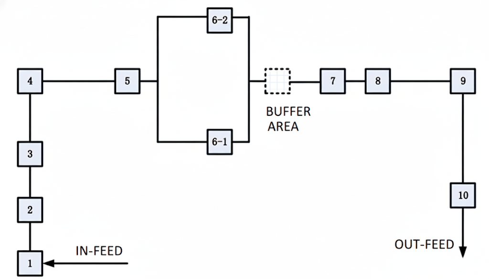

# Gurobi Model and Genetic Algorithm for the Hybrid Flow Shop Scheduling Problem with Sequence-Dependent Setup Times (HFSP-SDST) 

This is my course project for SJTU-IE4901 (2023 Autumn).

## Problem Description

HFSP-SDST is a complex combinatorial optimization problem (NP-hard) frequently encountered in modern manufacturing. It involves determining the optimal machine assignment and job sequence across multiple production stages to minimize the **Makespan ($C_{max}$)**.

### Objectives

The goal is to determine the optimal **allocation of machines** and **sequence of jobs** at each stage to optimize the total makespan.

### Example

The following diagram illustrates a representative **Hybrid Flow Shop** configuration which is also used as the instance in this project.

- **Hybrid Stage (Stage 6)**: This stage features two parallel machines (**6-1** and **6-2**), representing a typical capacity bottleneck or flexibility point where a job can be assigned to either machine.

#### Constraints & Rules

- **Processing Flow**: Every workpiece must pass through stations 1 to 10 in strict numerical order (no skipping).

- **Sequence Invariance**:
  - The processing sequence determined at Station 1 must remain identical through Stations 2–5.
  - The sequence determined at Station 7 must remain identical through Stations 8–10.

- **Station 6 Logic**: 
  - Workpieces from Station 5 must enter an available machine in Station 6 immediately if one is free (no waiting).
  - Processing time for M6-2 is 1.2x the time required for M6-1.

- **Reordering**: The buffer after Station 6 allows for the re-sequencing of workpieces before they enter Station 7.

- **Setup Time (Changeover)**:
  - Switching between different types of workpieces requires a specific setup time.
  - No pre-setup: Setup can only begin after the workpiece has arrived at the machine.
  - The first workpiece processed on any machine requires zero setup time.

To minimize the total completion time, the following must be determined:

1. **Input Sequence**: The optimal processing order for Stations 1–5.
2. **Station 6 Allocation**: The distribution of workpieces between the two parallel machines in Station 6.
3. **Output Sequence**: The optimal re-sequenced processing order for Stations 7–10.

## Mathematical Model

See  [Mathematical Model.pdf](assets\Mathematical Model.pdf) 

## Algorithm Overview

The algorithm is based on the classic **Genetic Algorithm (GA)** framework with *some configurable options*. Five simple heuristics are implemented to construct initial solutions:

1. SPTCH
2. FTMIH
3. Johnson's Rule
4. FRB41
5. IOBS

## Reference

1. Pan, Q. K., Gao, L., Li, X. Y., & Gao, K. Z. (2017). Effective metaheuristics for scheduling a hybrid flowshop with sequence-dependent setup times. *Applied Mathematics and Computation*, *303*, 89-112.
2. Ruiz, R., Maroto, C., & Alcaraz, J. (2005). Solving the flowshop scheduling problem with sequence dependent setup times using advanced metaheuristics. *European Journal of Operational Research*, *165*(1), 34-54.
3. Kurz, M. E., & Askin, R. G. (2004). Scheduling flexible flow lines with sequence-dependent setup times. *European Journal of Operational Research*, *159*(1), 66-82.
4. Riahi, V., Newton, M. H., & Sattar, A. (2021). Constraint based local search for flowshops with sequence-dependent setup times. *Engineering Applications of Artificial Intelligence*, *102*, 104264.